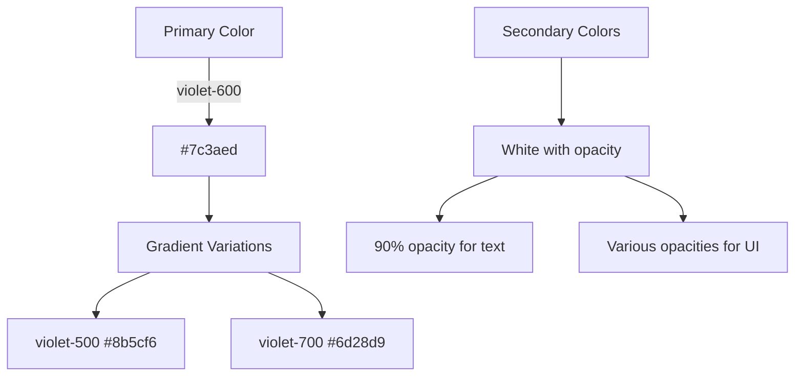

# Blossomss Branding & Styling Guide

## Core Brand Colors



### Primary Colors
- **Base Purple**: `rgb(109 40 217)` / `#6d28d9` (violet-700)
- **Main Accent**: `#7c3aed` (violet-600)
- **Light Accent**: `#8b5cf6` (violet-500)
- **White**: Used with various opacity levels for secondary elements

### System Colors
- Background: `hsl(var(--background))`
- Foreground: `hsl(var(--foreground))`
- Border: `hsl(var(--border))`
- Input: `hsl(var(--input))`
- Ring: `hsl(var(--ring))`

## Typography

### Font Families
- **Primary Font**: 'Inter', system-ui, sans-serif
- **Decorative Font**: 'Dancing Script', cursive
  - Used for special headings and accent text

### Text Styles
- **Primary Text**: 90% opacity white
- **Secondary Text**: 70% opacity white
- **Headers**: Bold, violet-600
- **Links**: violet-500 with hover effects

## Component Patterns

### Buttons
```typescript
// Primary Button
<button className="bg-violet-600 hover:bg-violet-700 text-white px-4 py-2 rounded-lg 
  shadow-lg hover:shadow-xl transition-all duration-300" />

// Secondary Button
<button className="bg-white/10 hover:bg-white/20 text-white px-4 py-2 rounded-lg 
  backdrop-blur-sm transition-all duration-300" />
```

### Cards and Containers
```typescript
// Standard Card
<div className="bg-white/5 backdrop-blur-sm rounded-xl p-6 shadow-lg hover:shadow-xl 
  transition-all duration-300" />

// Content Section
<section className="bg-gradient-to-b from-violet-600/10 via-transparent to-transparent" />
```

### Navigation
- **Header**: Fixed position with violet-700 background
- **Dropdowns**: White background with violet hover states
- **Active States**: violet-600 underline or background

## Visual Effects

### Speech Bubbles
```typescript
// Parent Speech Bubble
<div className="bg-white/98 backdrop-blur-[2px] rounded-[28px] sm:rounded-[32px] 
  px-6 sm:px-7 md:px-8 py-4 sm:py-5
  shadow-[0_4px_20px_-1px_rgba(124,58,237,0.25),0_2px_8px_-1px_rgba(124,58,237,0.15)]
  border border-violet-300/70
  hover:shadow-[0_8px_32px_-4px_rgba(124,58,237,0.4),0_4px_16px_-2px_rgba(124,58,237,0.3)]
  hover:border-violet-400/80" />

// Child Speech Bubble
<div className="bg-white rounded-[20px] px-3 sm:px-4 md:px-5 py-2 sm:py-2.5 md:py-3
  shadow-[0_4px_20px_-1px_rgba(124,58,237,0.25),0_2px_8px_-1px_rgba(124,58,237,0.15)]
  border border-violet-300/70
  hover:shadow-[0_8px_32px_-4px_rgba(124,58,237,0.4),0_4px_16px_-2px_rgba(124,58,237,0.3)]
  hover:border-violet-400/80 hover:-translate-y-1 hover:scale-[1.02]" />
```

### Parallax Background
```typescript
// Base gradient layers
<div className="absolute inset-0 bg-gradient-to-b from-violet-50 via-violet-100/80 to-violet-50/50" />
<div className="absolute inset-0 bg-gradient-radial from-violet-100/40 via-violet-50/30 to-transparent" />

// Glow effects
<div className="absolute top-1/2 left-1/2 -translate-x-1/2 -translate-y-1/2 w-[60rem] h-[60rem] 
  rounded-full opacity-40 bg-[radial-gradient(circle,rgba(124,58,237,0.2)_0%,rgba(139,92,246,0.15)_30%,transparent_70%)]
  filter blur-[100px]" />
```

### Gradients
```typescript
// Background Gradient
"bg-gradient-to-b from-primary/5 via-transparent to-transparent"

// Interactive Gradient
"hover:bg-gradient-to-r from-violet-600 to-violet-500"

// Ambient Glow
"bg-gradient-radial from-violet-400/20 via-violet-400/10 to-violet-400/20"
```

### Shadows and Depth
- **Base Shadow**: `shadow-lg`
- **Hover Shadow**: `shadow-xl`
- **Glow Effect**: `drop-shadow(0 0 4px rgba(124, 58, 237, 0.3))`

### Animations
```css
/* Float Animation */
@keyframes float {
  '0%, 100%': { transform: 'translateY(0)' },
  '50%': { transform: 'translateY(-20px)' }
}

/* Highlight Animation */
@keyframes highlight {
  0% { filter: brightness(1) drop-shadow(0 0 0 rgba(124, 58, 237, 0)) }
  50% { filter: brightness(1.2) drop-shadow(0 0 4px rgba(124, 58, 237, 0.3)) }
  100% { filter: brightness(1) drop-shadow(0 0 0 rgba(124, 58, 237, 0)) }
}
```

## Layout Guidelines

### Spacing System
- **Container Width**: `max-w-6xl`
- **Padding**: 
  - Sections: `px-4 py-12`
  - Components: `p-6`
  - Buttons: `px-4 py-2`

### Responsive Design
```typescript
screens: {
  'xs': '375px',
  // Then follows Tailwind's default breakpoints
}
```

## Interactive Elements

### Hover States
- Increase opacity
- Add drop shadows
- Scale transform when appropriate
- Color transitions

### Focus States
- Violet ring outline
- Increased contrast
- Clear visual indicators

## Animation Patterns

### Timing Guidelines
- **Quick**: 150ms for immediate feedback
- **Standard**: 300ms for most transitions
- **Smooth**: 500ms for larger animations
- **Float**: 6s for ambient motion
- **Typing**: 70ms word delay for speech bubbles

### Framer Motion Animations

```typescript
// Basic Page Transition
<motion.div
  initial={{ opacity: 0, y: 20 }}
  animate={{ opacity: 1, y: 0 }}
  exit={{ opacity: 0, y: -20 }}
  transition={{ duration: 0.5 }}
/>

// Section Transition with Spring
<motion.div
  variants={{
    inactive: {
      opacity: 0,
      y: '100%',
      scale: 1.02,
      transition: { 
        type: "spring",
        stiffness: 80,
        damping: 15,
        mass: 0.8
      }
    },
    active: {
      opacity: 1,
      y: 0,
      scale: 1
    }
  }}
/>

// Floating Animation
<motion.div
  animate={{
    y: [0, -20, 0],
    scale: [1, 1.02, 1],
    rotate: [-1, 1, -1]
  }}
  transition={{
    duration: 4,
    repeat: Infinity,
    ease: "easeInOut"
  }}
/>
```

### Interactive Animations

```typescript
// Hover and Tap Effects
<motion.button
  whileHover={{ scale: 1.05, y: -2 }}
  whileTap={{ scale: 0.95 }}
  transition={{
    type: "spring",
    stiffness: 400,
    damping: 10
  }}
/>

// Scroll Indicator
<motion.div
  animate={{
    y: [0, 6, 0],
    opacity: [0.7, 1, 0.7]
  }}
  transition={{
    duration: 1.5,
    repeat: Infinity,
    ease: "easeInOut"
  }}
/>
```

### Background Effects

```typescript
// Parallax Scrolling
const { scrollYProgress } = useScroll();
const bg1Y = useTransform(scrollYProgress, [0, 1], ["0%", "20%"]);
const bg2Y = useTransform(scrollYProgress, [0, 1], ["0%", "40%"]);

<motion.div style={{ y: bg1Y }}>
  {/* Background content */}
</motion.div>

// Ambient Glow Animation
<motion.div
  initial={{ opacity: 0.3 }}
  animate={{ opacity: [0.3, 0.6, 0.3] }}
  transition={{
    duration: 4,
    repeat: Infinity,
    ease: "easeInOut"
  }}
/>
```

### CSS Animations

```css
/* Float Animation */
@keyframes float {
  '0%, 100%': { transform: 'translateY(0)' },
  '50%': { transform: 'translateY(-20px)' }
}

/* Highlight Animation */
@keyframes highlight {
  0% { filter: brightness(1) drop-shadow(0 0 0 rgba(124, 58, 237, 0)) }
  50% { filter: brightness(1.2) drop-shadow(0 0 4px rgba(124, 58, 237, 0.3)) }
  100% { filter: brightness(1) drop-shadow(0 0 0 rgba(124, 58, 237, 0)) }
}

/* Reading Highlight Animation */
@keyframes reading-highlight {
  0% {
    background-color: transparent;
    transform: scale(0.98);
    opacity: 0;
  }
  20% {
    background-color: var(--highlight-color);
    transform: scale(1);
    opacity: 1;
  }
  80% {
    background-color: var(--highlight-color);
    transform: scale(1);
    opacity: 1;
  }
  100% {
    background-color: transparent;
    transform: scale(0.98);
    opacity: 0;
  }
}
```

## Implementation Guide

### New Components Checklist
1. Use ShadCn/ui base components when available
2. Apply consistent spacing patterns
3. Follow the color hierarchy
4. Implement proper hover/focus states
5. Add appropriate animations
6. Ensure responsive design
7. Test in both light/dark modes

### Code Structure
```typescript
// Component Template
export function ExampleComponent() {
  return (
    <div className="bg-white/5 backdrop-blur-sm rounded-xl p-6">
      <div className="space-y-4">
        <h2 className="text-2xl font-bold text-violet-600">
          Title
        </h2>
        <div className="bg-gradient-to-b from-primary/5 via-transparent to-transparent">
          Content
        </div>
      </div>
    </div>
  );
}
```

## Accessibility Guidelines

- **Color Contrast**: Maintain WCAG 2.1 AA standard
- **Focus Indicators**: Visible and consistent
- **Text Size**: Minimum 16px for body text
- **Interactive Elements**: Clear visual feedback

## Best Practices

1. Use Tailwind's utility classes for consistency
2. Leverage ShadCn/ui components when available
3. Follow the established color hierarchy
4. Use proper CSS transitions for smooth interactions
5. Maintain consistent spacing patterns
6. Implement responsive design patterns
7. Test in both light and dark modes

## Landing Page Patterns

### Feature Showcase Pattern
The feature showcase demonstrates the core interaction patterns:

```typescript
// Feature Card Pattern
<motion.div
  className="absolute top-6 sm:top-8 left-1/2 transform -translate-x-1/2 z-40 
    flex flex-col items-center gap-3 
    bg-gradient-to-br from-violet-700 to-violet-500 
    px-6 py-3 rounded-2xl shadow-lg"
  initial={{ opacity: 0, y: -20, scale: 0.5 }}
  animate={{ opacity: 1, y: 0, scale: 1 }}
  exit={{ opacity: 0, y: -10, scale: 0.7 }}
  transition={{
    type: "spring",
    stiffness: 150,
    damping: 15,
    duration: 0.4
  }}
>
  <span className="text-4xl">{icon}</span>
  <h2 className="text-2xl font-semibold text-white">{title}</h2>
</motion.div>
```

### Values Section Pattern
Values section demonstrates card and grid layouts:

```typescript
// Values Card Pattern
<motion.div
  initial={{ opacity: 0, y: 20 }}
  whileInView={{ opacity: 1, y: 0 }}
  viewport={{ once: true }}
  className="group relative bg-violet-600/5 backdrop-blur-sm rounded-[20px] p-4 
    border border-violet-600/10
    hover:border-violet-400/30 hover:bg-violet-600/10
    transition-all duration-500 ease-out
    hover:shadow-[0_8px_32px_-4px_rgba(124,58,237,0.4),0_4px_16px_-2px_rgba(124,58,237,0.3)]
    hover:-translate-y-1"
>
  {/* Ambient glow effect */}
  <div className="absolute inset-0 bg-gradient-to-br from-violet-400/20 via-violet-400/10 to-violet-400/20 
    rounded-[20px] transform scale-105 opacity-0 group-hover:opacity-100 blur-xl transition-all duration-500 ease-out
    group-hover:animate-pulse" 
  />
  
  {/* Content */}
  <div className="relative flex items-start gap-3">
    <div className="p-2 bg-violet-600/10 rounded-xl">
      <Icon className="w-5 h-5 text-violet-600" />
    </div>
    <div>
      <h3 className="text-lg font-semibold text-violet-600/90">Title</h3>
      <p className="text-sm text-gray-600/80">Description</p>
    </div>
  </div>
</motion.div>
```

### Section Header Pattern
Used for major section headers:

```typescript
// Section Header Pattern
<div className="text-center pt-12 pb-8">
  <motion.h2 
    initial={{ opacity: 0, y: -20 }}
    animate={{ opacity: 1, y: 0 }}
    className="text-4xl md:text-5xl font-bold tracking-tight"
  >
    <span className="bg-clip-text text-transparent bg-gradient-to-r 
      from-violet-700 via-violet-600 to-violet-500
      drop-shadow-sm [text-shadow:0_4px_8px_rgba(124,58,237,0.1)]">
      Section Title
    </span>
  </motion.h2>
  <motion.p 
    initial={{ opacity: 0, y: -10 }}
    animate={{ opacity: 1, y: 0 }}
    transition={{ delay: 0.1 }}
    className="text-lg md:text-xl text-gray-600/90 mt-3
      [text-shadow:0_2px_4px_rgba(124,58,237,0.05)]"
  >
    Section Description
  </motion.p>
</div>
```

## Example Implementation

The landing page serves as the primary example of these guidelines in action, featuring:

1. **Brand Elements:**
   - Consistent use of violet color palette
   - Typography hierarchy with Dancing Script for headers
   - Shadcn/ui component system integration

2. **Interaction Patterns:**
   - Speech bubble interactions
   - Smooth section transitions
   - Scroll-based animations
   - Hover and focus states

3. **Visual Elements:**
   - Parallax backgrounds
   - Ambient glow effects
   - Gradient overlays
   - Shadow depth

4. **Animation Patterns:**
   - Spring animations for transitions
   - Floating animations for ambient movement
   - Typing animations for content
   - Scroll-based parallax effects

5. **Responsive Design:**
   - Mobile-first approach
   - Breakpoint-specific styling
   - Flexible layouts
   - Adaptive typography

Refer to this guide when creating new components or modifying existing ones to maintain consistency across the application.
